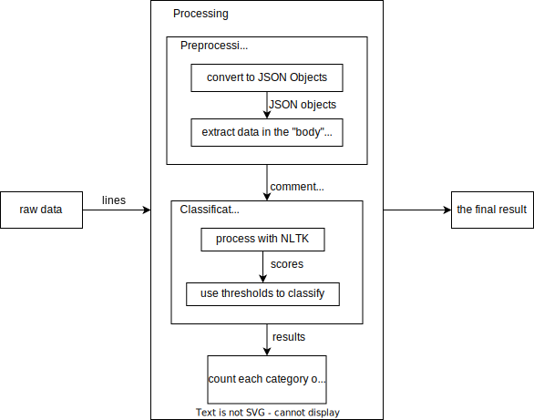
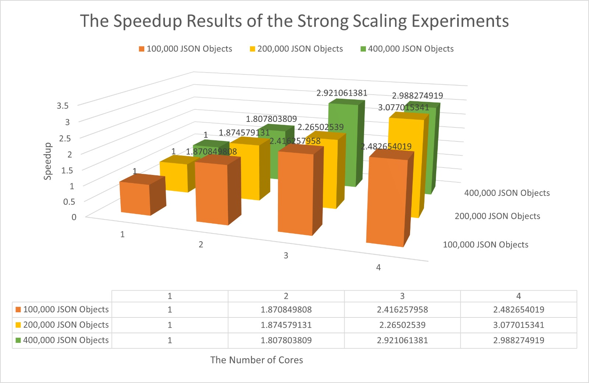
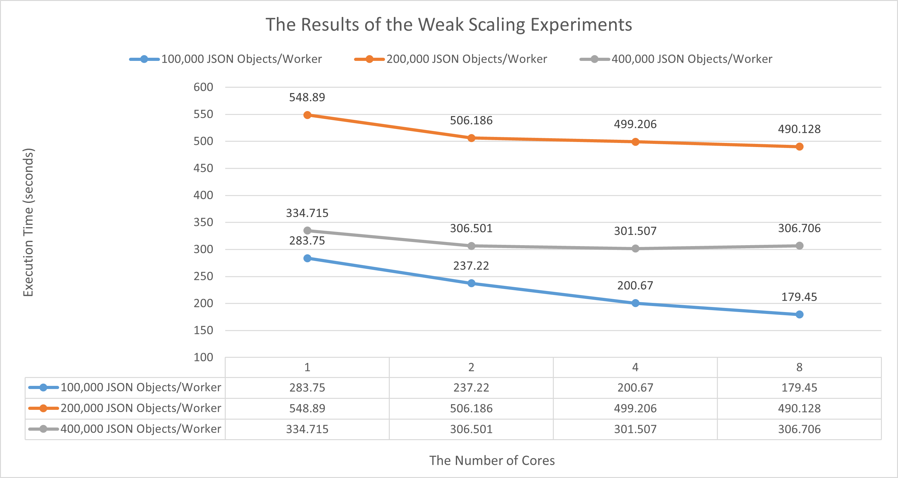

# 1TD169 Project Group 4

Group 4:
- Haodong Zhao
- Somiya Khurram
- Halit Ege Ebiller

Note: 
  ***We build up the cluster and do some parts of the experiments together, but I commit most parts of the things.***

# Overview
This repo is for the final project of Data Engineering I (1TD169). 

The purpose of this project is to develop a horizontally scalable data processing solution to do sentiment analysis: classify Reddit comments as “negative”, “neutral”, or “positive”, by using Natural Language Toolkit(NLTK). 

The pipeline of the solution has three steps:
1. Inputting Raw Data
2. Processing & Classification
3. Final results 

---
# Results

- Strong Scaling
  
  

- Weak Scaling

  

  
